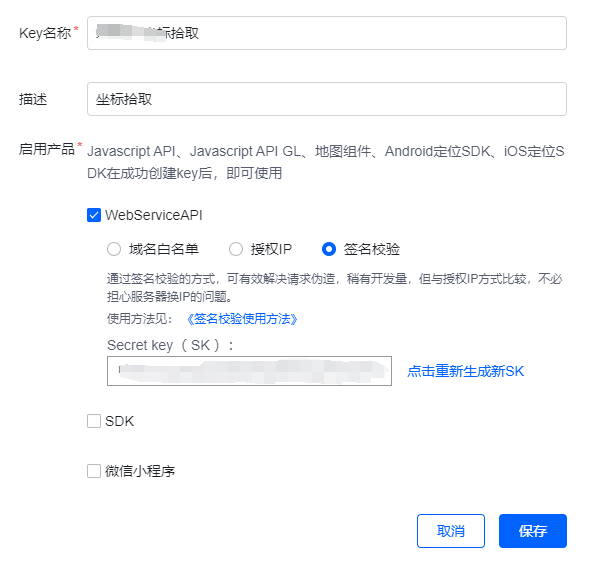
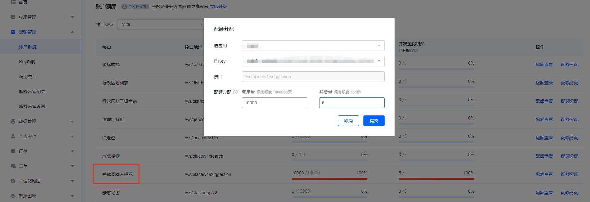

原经纬度选择器作者很久没更新了, 我使用腾讯地图选点的时候觉得很难用, 因为搜索结果的点总是遮挡住我要选的点, 只能自己稍微做修改自用

修改后的版本使用到了腾讯地图的 [**WebService API**](https://lbs.qq.com/service/webService/webServiceGuide/search/webServiceSuggestion), 所以需要去注册[**腾讯位置服务**](https://lbs.qq.com/dev/console/quota/account)注册账户创建一个 **Key** 和 **Secret key**


选择签名校验, 获取到**Secret key**




然后需要在**配额管理** - **账户额度** 里, 修改 **关键词输入提示** 这项, 点击**配额分配**, 填写到最大值, 提交即可, 一天10000次调用, 正常情况都是够用的, 如果额度不够用就只能去升级企业开发者了




最后把生成的 **Key** 和签名校验的 **Secret key** 加到.env配置文件即可正常使用

```
TENCENT_MAP_KEY=
TENCENT_MAP_SECRET=
```


以下是原作者的介绍中关于使用说明部分

经纬度选择器/Latitude and longitude selector
======

这个扩展用来帮助你在form表单中选择经纬度，用来替代`Laravel-admin`中内置的`Form\Field\Map`组件, 组件支持的地图包括`Google map`、`百度地图`、`高德地图`、`腾讯地图`、`Yandex map`.

This extension is used to help you select the latitude and longitude in the form, which is used to replace the  `Laravel-admin` built in `Form\Field\Map` component. The supported maps include `Google map`, `Baidu map`, `AMap`, `Tencent Map`, `Yandex map`.

## Installation

```bash
// For laravel-admin 1.x
composer require laravel-admin-ext/latlong:1.x -vvv

// For laravel-admin 2.x
composer require laravel-admin-ext/latlong:2.x -vvv
```

## Configuration

Open `config/admin.php` and add the following configuration to the extensions section:

```php

    'extensions' => [

        'latlong' => [

            // Whether to enable this extension, defaults to true
            'enable' => true,

            // Specify the default provider
            'default' => 'google',

            // According to the selected provider above, fill in the corresponding api_key
            'providers' => [

                'google' => [
                    'api_key' => '',
                ],
                
                'yandex' => [
                    'api_key' => '',
                ],

                'baidu' => [
                    'api_key' => 'xck5u2lga9n1bZkiaXIHtMufWXQnVhdx',
                ],

                'tencent' => [
                    'api_key' => 'VVYBZ-HRJCX-NOJ4Z-ZO3PU-ZZA2J-QPBBT',
                ],

                'amap' => [
                    'api_key' => '3693fe745aea0df8852739dac08a22fb',
                ],
            ]
        ]
    ]

```

## Usage

Suppose you have two fields `latitude` and `longitude` in your table that represent latitude and longitude, then use the following in the form:

```php
$form->latlong('latitude', 'longitude', 'Position');

// Set the map height
$form->latlong('latitude', 'longitude', 'Position')->height(500);

// Set the map zoom
$form->latlong('latitude', 'longitude', 'Position')->zoom(16);

// Set default position
$form->latlong('latitude', 'longitude', 'Position')->default(['lat' => 90, 'lng' => 90]);
```

Use in show page

```php
$show->field('Position')->latlong('lat_column', 'long_column', $height = 400, $zoom = 16);
```
